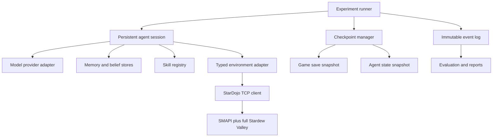

# PrimeStardew implementation plan

## Product decision

Use the owned full Stardew Valley installation as the environment and StarDojo as
the SMAPI adapter inside it.

This combination is appropriate because the research needs the real game's long
horizon, save system, seasonal changes, economics, social state, and map. StarDojo
provides machine-readable observations and actions without recreating the game.
The first live smoke test has already validated this approach on the local machine.

Treat StarDojo as replaceable infrastructure. PrimeStardew should depend on a typed
environment interface, not on StarDojo's raw TCP strings. This lets us patch,
upgrade, or replace StarDojo without rewriting the agent and experiment layers.

## Research objective

Build a controlled platform that can measure whether a persistent agent becomes
better through external memory, skills, reflection, belief revision, and learned
policies without changing model weights.

The first publishable question is:

> Given the same model and the same Stardew task distribution, how much improvement
> comes from retained experience, retrieval, procedural skills, and nightly
> refinement?

Success requires causal ablations, reproducible resets, immutable trajectories,
bounded model context, and recovery at every completed game day.

## Target architecture



### Module boundaries

```text
prime-stardew/
  src/prime_stardew/
    env/           typed observations, actions, lifecycle, checkpoints
    agent/         session loop, context builder, goals, reflection
    memory/        episodic, semantic, beliefs, retrieval, consolidation
    skills/        skill schema, executor, versions, usage statistics
    providers/     Prime/model provider interfaces and usage accounting
    experiments/   config, registry, runner, resume, condition switches
    telemetry/     events, trajectory writer, artifacts, validation
    evaluation/    task scorers, learning metrics, aggregation
  configs/         machine, agent, task, and experiment YAML
  tasks/           atomic, project, season, shifted-world definitions
  tests/           unit, replay, integration, checkpoint tests
  scripts/         setup, launch, smoke, run, restore
  docs/
```

Use Python 3.12 for the orchestration layer, Pydantic for schemas, YAML for run
configuration, JSON Lines for append-only events, and SQLite for indexed memory
metadata. Store large screenshots and save archives as files referenced by hashes.

## Core interfaces

### Environment adapter

```python
class StardewEnvironment(Protocol):
    def start(self, save_id: str) -> EnvironmentInfo: ...
    def observe(self, mode: ObservationMode) -> Observation: ...
    def act(self, action: Action) -> ActionResult: ...
    def pause(self) -> None: ...
    def resume(self) -> None: ...
    def finish_day(self) -> DayResult: ...
    def checkpoint(self, destination: Path) -> GameCheckpoint: ...
    def restore(self, checkpoint: GameCheckpoint) -> None: ...
    def close(self) -> None: ...
```

The implementation must validate every StarDojo response, attach a request ID,
enforce a timeout and maximum payload, retry only idempotent requests, and report
typed failures. Day completion should poll structured state and save hashes rather
than depend solely on the racy `DayStarted` event.

### Agent session

```python
class AgentSession(Protocol):
    def decide(self, context: WorkingContext) -> Decision: ...
    def reflect(self, day: DayTrajectory) -> ReflectionResult: ...
    def checkpoint(self, destination: Path) -> AgentCheckpoint: ...
    def restore(self, checkpoint: AgentCheckpoint) -> None: ...
```

Prime Agent should enter through a narrow programmatic adapter. If the installed
Prime version exposes RPC, use it. Keep a deterministic scripted agent and a replay
provider so environment work and evaluations never depend on a live model.

### Memory records

Every memory needs a stable ID, type, text or structured payload, source event IDs,
creation and update days, confidence, verification and contradiction counts,
retrieval statistics, tags, and status. Updating a belief creates a new version;
it does not erase the prior claim or its evidence.

### Skills

A skill contains a versioned plan or executable macro, input schema, preconditions,
postconditions, source events, test fixtures, usage count, success count, failure
count, and last validation date. A skill cannot become trusted until it passes a
replay test and at least one live fixture test.

## Milestones

The estimates assume one primary engineer. Gates are behavioral; elapsed time alone
does not complete a milestone.

### M0: Local environment proof, complete

**Goal:** Prove that the full game and StarDojo can support the platform.

Implemented:

- Installed and validated SMAPI 4.5.2 and StarDojo 1.0.0.
- Built a Stardew 1.6.15 compatibility patch.
- Isolated a disposable save from the personal farmer.
- Verified TCP, structured observation, screenshot payload, action mutation,
  pause/resume, day advance, save, restart, and checkpoint reload.
- Recorded exact versions and hashes.

**Gate:** Reloaded observation reports `PrimeStardewSmoke`, Spring 6, 06:00. Passed.

### M1: Reliable environment SDK, complete

**Goal:** Replace diagnostic scripts with a safe typed client.

Implementation:

- Create `StarDojoClient` with framing, EOF handling, request IDs, timeouts, size
  limits, reconnect, and typed exceptions.
- Parse `observe_v2` into Pydantic models while retaining the raw payload hash.
- Decode screenshots to image files and validate width, height, and byte count.
- Implement `start`, readiness polling, pause, resume, action, sleep, and shutdown.
- Detect port ownership before launch. Never kill an unknown process.
- Capture SMAPI logs and launched process metadata for each run.
- Add replay transport that serves recorded responses without launching the game.

Tests:

- Protocol unit tests for truncated EOF, oversized responses, bad JSON, timeout,
  disconnect, and retry rules.
- Replay tests for the recorded Spring 5 and Spring 6 observations.
- One opt-in live integration test on the isolated fixture.

**Gate:** Fifty scripted observe/action cycles complete without deadlock; forced
disconnect recovers; the client rejects malformed data with a useful error.

### M2: Deterministic saves and checkpoints, complete

**Goal:** Make every completed day recoverable and every experiment resettable.

Implementation:

- Define a fixture manifest with save ID, base hash, game version, mod hash, and
  expected starting state.
- Snapshot the game save only after the day and save file stabilize.
- Snapshot agent state, config, event cursor, memory database, skills, RNG seeds,
  provider metadata, and code revision in the same checkpoint directory.
- Write a checkpoint manifest last, using atomic rename, so partial checkpoints are
  never considered valid.
- Restore into experiment-owned save IDs and validate the first observation.
- Add retention policy: base fixture, last completed day, milestone checkpoints,
  and failure snapshots.

Implemented: stable and hash-verified game snapshots; append-only hash-chained
events; authenticated prefix cursors; atomic combined game, agent, configuration,
and cursor bundles; restore to a new experiment save ID; and live StarDojo reload of
the restored Spring 6 bundle. Verified retention protects special and invalid
bundles. A live Spring 6→7→8 run recovered from a post-action crash with rollback and
exactly one logical completion event.

**Gate:** Interrupt a run during Day 3, restore Day 2, and reproduce the same
starting observation and manifest hashes without touching a personal save.

### M3: Action model and deterministic task harness, complete

**Goal:** Separate motor control from reasoning experiments.

Implementation:

- Define low-level actions: move, turn, interact, select slot, use, menu choice,
  pause, and sleep.
- Define macro results with explicit preconditions, progress, postconditions,
  consumed game time, retry count, and failure reason.
- Implement initial macros: observe, navigate to named map/coordinate, buy, sell,
  water a known plot, plant a known plot, talk, return home, and finish day.
- Macros may call path planning and structured state directly but must log each
  primitive action for comparison.
- Create task fixtures and scorers for five atomic tasks: turn/move, water a crop,
  clear debris and collect its resource, harvest a crop, and transfer an item to a
  chest.
- Add invariant checks for farmer identity, date bounds, money, inventory, location,
  and menus before and after actions.

**Gate:** A scripted policy completes all five atomic tasks from clean resets on
three repetitions, with no manual input and no privileged debug command in scored
runs.

Implemented: versioned immutable fixture definitions; normalized player, crop,
tile, menu, inventory, and chest state; contiguous primitive action traces; action
and game-time budgets; allowlisted typed live dispatch; deterministic component
scores; and an enforced boundary between privileged setup and scoring. The live
Spring 8 probe completed 15 of 15 runs with score 1.0 and zero privileged scored
actions.

### M4: Experiment runner and event store, complete

**Goal:** Run, resume, and audit experiments from one configuration file.

Implementation:

- Validate YAML into immutable run configuration.
- Generate stable run IDs from suite, model, condition, seed, and config hash.
- Write append-only JSONL events with monotonic sequence numbers.
- Store observations, decisions, actions, outcomes, model calls, memory reads and
  writes, skill uses, checkpoints, errors, and recovery events.
- Record git revision, dirty patch hash, game/mod versions, provider route, token
  counts, latency, cost, and artifact hashes.
- Build a lifecycle state machine: created, running, day-complete, interrupted,
  recovering, completed, failed.
- Make resume idempotent from the latest valid completed-day checkpoint.

**Gate:** Two identical scripted runs produce equivalent normalized trajectories;
an interrupted run resumes without duplicated actions or events.

Implemented: strict frozen YAML configuration; canonical SHA-256 configuration
hashes and stable run IDs; code, runtime, and provider provenance; the full
created/running/day-complete/interrupted/recovering/completed/failed lifecycle;
idempotent task and primitive-action events; model usage, memory, skill, artifact,
and error telemetry; budget enforcement; normalized trajectory digests; atomic
config persistence; and checkpoint restore with configuration validation. The M4
gate produced matching digests for two independent runs and added zero duplicate
events when a recovered task completion was replayed.

### M5: Prime and provider integration, 1 to 2 weeks

**Goal:** Run a bounded-context Prime Agent through the same harness.

Implementation:

- Add `PrimeSession` around the available programmatic interface.
- Add provider-neutral request and response schemas.
- Record actual model/provider route, decoding settings, usage, latency, cost, and
  request ID.
- Build a working-context assembler with fixed token budgets for objective, current
  observation, active goals, retrieved memories, applicable skills, and recent
  events.
- Require decisions to conform to a structured action schema; repair malformed
  output once, then fail visibly.
- Pause game time during inference by default.
- Add budget stops for model calls, tokens, dollars, wall time, actions, and game
  days.

**Gate:** Prime completes the five atomic tasks, every model call is attributable,
and a resumed session preserves goals without replaying the full transcript.

Implemented: provider-neutral frozen schemas; deterministic context budgeting with
included/omitted evidence IDs; strict allowlisted JSON decisions; one repair attempt;
preflight and post-response budget checks; game pause/resume in a failure-safe block;
actual provider, model, API route, usage, latency, cost, decoding, and request-ID
telemetry; bounded session-state checkpoint and restore; a persistent subprocess
adapter for Prime Agent's official JSONL RPC mode; and a five-task offline contract
gate over the live-recorded M3 trajectories. Prime Agent 0.9.5 is installed in the
project runtime with a verified private Node 22.23.2 distribution, and its no-model
RPC state probe passed. The authenticated live gate passed all five atomic tasks at
1.0 through OpenRouter `z-ai/glm-5.3`, with six fully attributable calls and no
privileged actions in scored trajectories. M5 is complete.

### M6: Persistent memory and retrieval ablations, 2 weeks

**Goal:** Isolate the effect of stored experience.

Implementation:

- Store raw episodes separately from derived semantic memories and beliefs.
- Implement keyword/metadata retrieval first; add embeddings only after a baseline
  is measured.
- Filter by season, map, task domain, validity interval, and confidence.
- Log candidates, selected memories, rank features, token cost, and later utility.
- Implement condition flags independently: stateless, bounded context, persistent
  memory, and memory plus retrieval.
- Add memory export/import with provenance for transfer studies.

**Gate:** The same model can run all four conditions from identical checkpoints,
and removing memory state removes the measured benefit without changing game state.

Implemented: immutable typed memory records in SQLite with separate episode,
semantic, and belief kinds; append-only status history and explicit supersession;
keyword and metadata retrieval with season, map, task-domain, validity, and confidence
filters; candidate rank features, selected IDs, and token-cost telemetry; independent
learning-condition flags; hashed export/import bundles with provenance; session memory
read/write integration; and memory database snapshots in combined checkpoints. The
deterministic contract and authenticated OpenRouter `z-ai/glm-5.3` paired ablations
both passed. All conditions shared one checkpoint digest and model configuration;
only memory plus retrieval selected the hidden fact, and removing memory eliminated
the gain. M6 is complete.

### M7: Reflection, beliefs, and consolidation, complete

**Goal:** Convert experience into inspectable, revisable knowledge.

Implementation:

- At day end, select evidence within a fixed reflection budget.
- Produce lessons, failed assumptions, counterfactuals, goals, and confidence-rated
  beliefs that cite source event IDs.
- Merge repeated episodes into semantic rules while preserving provenance.
- Represent contradiction as evidence against a versioned belief.
- Support fixed nightly, failure-triggered, surprise-triggered, and agent-selected
  refinement policies.
- Score calibration using predicted versus observed outcomes.

**Gate:** On a hidden crop-rule fixture, the agent forms a supported rule, revises
it after contradictory evidence, and never presents a deleted or superseded belief
as current.

Implemented: deterministic fixed-budget evidence selection; schema-validated reflection
outputs for lessons, failed assumptions, counterfactuals, goals, beliefs, and predictions;
strict source-event citation checks; immutable belief versions with explicit supersession;
contradiction evidence requirements; active-only retrieval; deterministic episode-to-semantic
consolidation with complete provenance; nightly, failure, surprise, and agent-selected
policies; and Brier-score calibration. The deterministic and authenticated OpenRouter
`z-ai/glm-5.3` gates both passed. The authenticated run used two attributable model calls
in one direct Prime RPC process and retained an 11-record verified event chain. M7 is complete.

### M8: Procedural skills, complete

**Goal:** Measure whether repeated reasoning becomes reusable procedure.

Implementation:

- Let the agent propose skills from repeated successful trajectories.
- Validate schemas and restrict execution to the environment API.
- Run generated skills first in replay and disposable fixtures.
- Version every edit and retain rollback.
- Attribute model calls and primitive actions saved by each skill.
- Add the fifth ablation: memory plus retrieval plus skills.

**Gate:** A learned watering or shopping skill succeeds three times and reduces
model decisions while maintaining task outcome.

Implemented: immutable parameterized skill definitions with provenance; model proposals
restricted to repeated successful trajectories; exact parameter typing and bounds; a compiler
limited to the M3 typed environment actions; replay and disposable-live validation before
activation; append-only creation, validation, activation, use, and rollback history; retained
prior versions; and per-use model-decision and primitive-action attribution. The deterministic
D-versus-E ablation and authenticated OpenRouter `z-ai/glm-5.3` live gate both passed. The
watering skill scored 1.0 three times, reduced three baseline decisions to one amortized
proposal call, and correctly reported zero primitive-action savings. M8 is complete.

### M9: Project and season benchmarks, complete

**Goal:** Move from integration tasks to meaningful continual learning.

Implement three project tasks:

- Harvest 10 cauliflower while retaining at least 1,500g.
- Reach mine level 40 and upgrade the pickaxe.
- Build a coop and obtain the first chicken.

Then implement a 28-day Spring benchmark with outcome, efficiency, learning,
memory, skill, and system metrics. Run at least three seeds per harness condition
before drawing conclusions.

**Gate:** A 28-day run completes unattended, resumes after an injected crash, and
produces a report from raw events without manual score editing.

Implemented: immutable fixtures for cauliflower plus gold reserve, mine depth plus pickaxe
upgrade, and coop plus first chicken; typed season state and project actions; daily outcome
and intermediate-progress scoring; a deterministic 28-day Spring replay environment; atomic
state/config/cursor checkpoints with tamper detection; injected interruption and exact-day
resume; environment, efficiency, learning, memory, skill, and system metrics; three-seed
aggregation; and a standalone raw-event report builder. All three seeds completed every
project. The interrupted seed restored Day 14 and the reporter found exactly one completion
for each day 1 through 28. No causal conclusion is drawn from the deterministic policy.
M9 is complete.

### M10: Causal continual-learning studies, complete

**Goal:** Establish the first research result.

Priority experiments:

1. Episodic to semantic consolidation.
2. Proceduralization gain.
3. Surprise-triggered versus nightly refinement.
4. Fixed memory budget with selective forgetting.
5. Active experimentation under unknown crop economics.
6. Stability and plasticity under a changed rule set.

For each study, pre-register task, conditions, seeds, primary metric, exclusion
rules, budgets, and statistical test. Use paired checkpoints where possible.

**Gate:** At least one study has repeatable multi-seed results, complete provenance,
confidence intervals, failure analysis, and a one-command reproduction path.

Implemented: an immutable, content-hashed preregistration for the proceduralization study;
eight fixed paired seeds; D memory-plus-retrieval and E memory-plus-retrieval-plus-skills
conditions that differ only in skill availability; identical authenticated starting state;
raw hash-chained events and immutable per-run configurations; a deterministic paired bootstrap
95% confidence interval; an exact two-sided sign test; outcome non-inferiority; explicit
exclusion and failure analysis; and a one-command reproduction gate. Procedural skills reduced
model decisions by 5 per season in every pair, 95% CI [5, 5], p=0.0078125, while all three
projects, mean outcome, and 592 primitive actions were unchanged. The result is causal within
the deterministic season-replay environment and does not establish transfer to live game play.
M10 is complete.

### M11: Lifetime, transfer, and learned routing, controlled gate complete

**Goal:** Test improvement across a full game year and across model identities.

- Run 112-day studies with seasonal retrieval and dormant-skill tests.
- Transfer memories and skills independently between models.
- Compare fresh recipient, memories only, skills only, and full inherited state.
- Give the agent a fixed inference budget and multiple model tiers, then measure
  whether its routing policy improves utility per dollar.
- Study agent lineages only after single-agent causal results are stable.

**Gate:** A fresh recipient model gains on held-out tasks from transferred external
state, with contamination and raw-model baselines reported.

Implemented: immutable 112-day/four-season configuration; hash-bound checkpoints on Days 28,
56, 84, and 112; seasonal retrieval; an 84-day dormant-skill retention test; independently
exportable authenticated memory and skill bundles; validation and activation evidence in skill
transfer; four versioned held-out tasks; contamination scanning; raw-model, fresh-recipient,
memories-only, skills-only, and full-inheritance comparisons; and fixed-cost model-tier routing.
Full inheritance improved held-out success from 0.5 to 1.0 and reduced decisions from 8 to 4.
Learned routing completed 8/8 tasks for $0.012 and raised utility per dollar from 500 to 666.67.
The controlled gate uses distinct scripted identities. External validation then passed with an
authenticated OpenRouter `z-ai/glm-5.3` recipient: fresh context scored 0/2, transferred semantic
memory scored 2/2, and the imported live-validated watering skill scored 1.0 on Spring 28 after
20 observed disposable-save day transitions. The live trajectory used three ordinary actions and
no privileged action. A fully autonomous 112-day live-game run remains future scale validation.

### M12: Self-improving memory management, complete

**Goal:** Test whether an agent can improve future utility per retained token under explicit
active-memory capacity.

- Add immutable token-budget and policy configuration to each run.
- Preserve every record and status transition while changing active retrieval eligibility.
- Compare FIFO, LRU, least-retrieved, fixed-seed random, no deletion, and strict agent selection.
- Authenticate status history in memory transfer bundles and preserve checkpoint state exactly.
- Reconstruct paired multi-seed results solely from hash-chained events.

**Gate:** Agent-selected bounded memory improves preregistered held-out utility density over FIFO,
with matched candidate states, enforced budgets, machine-readable failures, and one authenticated
provider decision.

Implemented: 40 controlled runs across eight paired seeds and five conditions. Agent selection
retained two useful rules in 17 tokens, achieved 0.11765 utility/token, and exceeded FIFO's
0.05556 by 0.06209 (paired-bootstrap 95% CI [0.06209, 0.06209], exact sign test p=0.0078125).
No fallback, exclusion, budget violation, state mismatch, or manual score edit occurred. An
authenticated OpenRouter `z-ai/glm-5.3` call reproduced the two-rule selection in one strict call,
scored 2/2 against FIFO's 1/2, and reconstructed the report from 18 authenticated events.

### M13: Experience-replay prioritization, complete

**Goal:** Test whether an agent can improve held-out performance by choosing which prior
experiences to review under a fixed replay budget.

- Represent replay candidates with stable IDs, capability, outcome, prediction error, surprise,
  stakes, age, lesson, and source-event provenance.
- Compare no replay, recency, fixed-seed random, error priority, and strict agent priority.
- Keep held-out correct actions outside policy input while exposing task capabilities and prompts.
- Require exact candidate coverage, reject unknown or duplicate IDs, and enforce the replay budget.
- Link each learning update to its exact replay event and reconstruct results from raw events.

**Gate:** Agent-prioritized replay improves paired held-out accuracy over error-priority replay,
with matched candidates and evaluations, no hidden-answer exposure, and one authenticated provider
decision.

Implemented: 40 controlled runs across eight seeds and five conditions. Agent replay scored 1.0
held-out accuracy and 1.0 useful-replay precision with zero waste; error priority scored 0.6667 and
wasted one of three reviews. The paired effect was +0.3333 with bootstrap 95% CI
[0.3333, 0.3333] and exact sign-test p=0.0078125. Authenticated OpenRouter GLM 5.3 reproduced the
three useful selections in one call, scored 3/3 versus the 2/3 error-priority counterfactual, and
reconstructed a provenance-valid 24-event result for $0.00169476.

### M14: Active experimentation and scientific learning, complete

**Goal:** Test whether an agent sacrifices immediate value to identify a hidden mechanic when the
expected future gain warrants it, while declining experiments whose expected value is negative.

- Reuse immutable belief records and supersession for explicit hypotheses and revisions.
- Keep realized hidden mechanics out of policy and provider input.
- Compare no uncertainty, belief-only, agent, oracle, and fixed-seed random conditions.
- Charge explicit test overhead and attribute later reward to acquired information.
- Reconstruct all study results from authenticated raw events.

**Gate:** Under matched hidden worlds, agent experimentation improves preregistered net reward
over belief tracking alone, abstains on every negative-value case, and passes one authenticated
provider decision with evidence-linked belief revision.

Implemented: 40 controlled runs across eight seeds and five conditions. Agent experimentation
raised mean reward from 1,680 to 2,280, a paired +600 effect with bootstrap 95% CI [600, 600] and
exact sign-test p=0.0078125. It acquired 2 bits per run, attributed 600 future reward to learned
mechanics, and performed zero negative-value tests. Authenticated GLM 5.3 made the same choices in
two bounded calls, created two provenance-valid belief revisions, and rebuilt its result from 22
events at a reported cost of $0.0054756.

## Initial experiment matrix

| Condition | Recent context | Persistent memory | Retrieval | Skills | Refinement |
|---|---:|---:|---:|---:|---:|
| A Stateless | No | No | No | No | No |
| B Context only | Yes | No | No | No | No |
| C Memory | Yes | Yes | No | No | No |
| D Memory plus retrieval | Yes | Yes | Yes | No | No |
| E Skills | Yes | Yes | Yes | Yes | No |
| F Full | Yes | Yes | Yes | Yes | Yes |

Run conditions from copied checkpoints with the same model configuration and task
seed. Treat provider fallback, model revisions, or manual game input as run metadata
that may invalidate a paired comparison.

## Metrics

Record raw components before derived scores:

- Environment: gold, assets, crops, mine depth, buildings, skills, quests,
  relationships, unlocks.
- Efficiency: decisions, primitive actions, retries, invalid actions, navigation
  failures, wasted travel, pass-outs, energy and game-time waste.
- Learning: first-exposure score, later score, observations to criterion, transfer,
  retention, forgetting, adaptation lag, regret.
- Memory: count, bytes, compression, retrieval precision, contradictions, stale
  retrievals, unused fraction, attributed utility.
- Skills: creation, versions, reuse delay, success, failure, composition, decisions
  and actions saved.
- Systems: calls, tokens, latency, cost, wall time, checkpoints, crashes, recovery.

Primary derived measures:

```text
learning_gain = later_performance - first_exposure_performance
transfer_gain = experienced_agent - fresh_agent_on_same_checkpoint
forgetting = earlier_peak - delayed_retest
adaptation_lag = steps_until_new_policy_meets_criterion
proceduralization_gain = decisions_before_skill / decisions_after_skill
cognitive_efficiency = environment_utility / inference_cost
```

## Observation policy

Support four modes and label them in every run:

- `structured_local`: player-visible local state and current menus.
- `multimodal_local`: screenshot plus local structured state.
- `structured_global`: broad StarDojo state for development and upper bounds.
- `replay`: recorded observations for deterministic tests.

Do not score normal learning experiments with global NPC schedules, unseen map
state, or hidden simulator truth. Keep hidden truth available to the evaluator.

## Reproducibility and safety rules

- Never load or mutate a personal save in automated runs.
- Address saves by validated save ID, not load-menu index.
- Keep fixture originals read-only and restore into a new run-owned save ID.
- Bind StarDojo to loopback and reject remote connections.
- Treat every mod DLL and model-generated skill as versioned experiment input.
- Preserve raw events; derived databases and reports must be rebuildable.
- Record source and binary hashes in every run manifest.
- Stop on identity, date, or checkpoint invariant failures.
- Keep game process ownership explicit; do not use blanket port-killing scripts.

## M15 completion and immediate next work

M15 now provides versioned seeded counterfactual mechanics, matched `A -> B -> A` execution,
rigidity/global-overwrite/contextual/fresh controls, immutable context-specific belief revisions,
raw-event metric reconstruction, and a preregistered eight-seed study. The final 32-run gate and an
authenticated two-call GLM 5.3 context-selection gate passed. See
[`m15-stardew-shift-result.md`](m15-stardew-shift-result.md).

M16 memory corruption and autonomous repair is next. It should inject plausible false, stale, and
overconfident records without labeling them, then test detection, correction, recurrence, and
utility loss under matched budgets.
